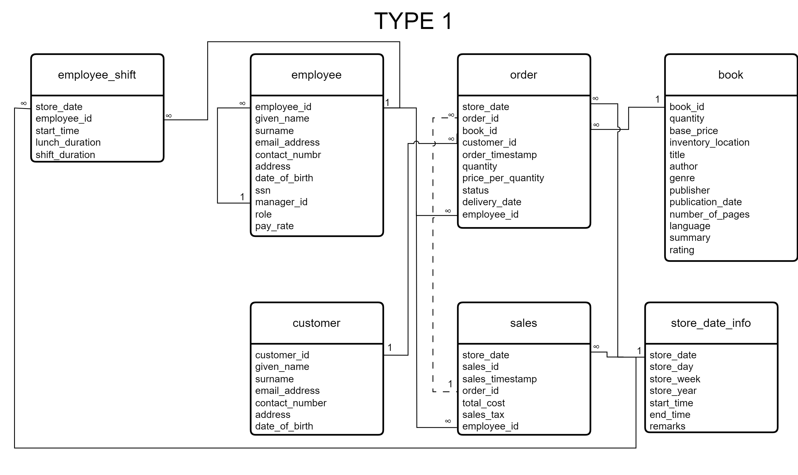
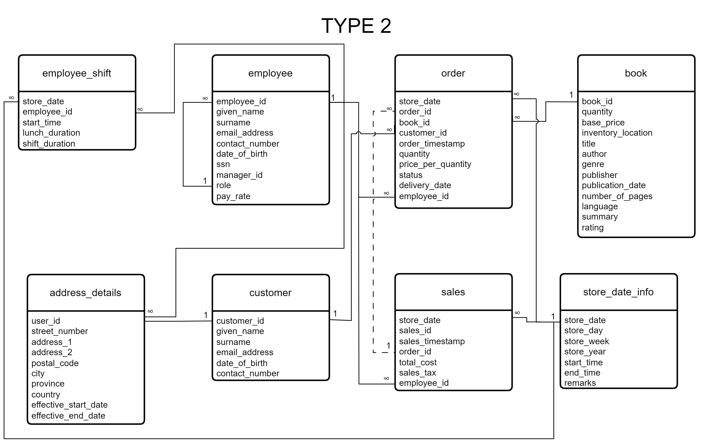

# Assignment 1: Design a Logical Model

## Question 1
Create a logical model for a small bookstore. 📚

At the minimum it should have employee, order, sales, customer, and book entities (tables). Determine sensible column and table design based on what you know about these concepts. Keep it simple, but work out sensible relationships to keep tables reasonably sized. Include a date table. There are several tools online you can use, I'd recommend [_Draw.io_](https://www.drawio.com/) or [_LucidChart_](https://www.lucidchart.com/pages/).

### Answered in question 3 (Type1 image)

## Question 2
We want to create employee shifts, splitting up the day into morning and evening. Add this to the ERD.

### Answered in question 3 (Type1 image)

## Question 3
The store wants to keep customer addresses. Propose two architectures for the CUSTOMER_ADDRESS table, one that will retain changes, and another that will overwrite. Which is type 1, which is type 2?





_Hint, search type 1 vs type 2 slowly changing dimensions._

Bonus: Are there privacy implications to this, why or why not?
```
Your answer...
```

Yes, there are privacy implications with storing personally identifiable information (PII), in my schema, PII is already in play once I included the full name of the user, adding further details such as address, email, and contact number further specifies the user. 

There are implications that would apply for both the company and the user itself:

For the company, we should adhere to the frameworks in collecting PII such as PIPEDA, CCPA, GDPR, etc. generally following these frameworks allows us to safeguard customer data and ensure high privacy standards for our company.

For the user, they are the most affected in case of the misuse of data, and the implications vary heavily, from something as simple as unwanted attention, some spam, or unwanted flyers in their mail, to something as serious as identity theft or even harassment.

Thus, we should always be very careful in handling PII data in our systems, and be informed of these frameworks so we can better protect this data.

## Question 4
Review the AdventureWorks Schema [here](https://imgur.com/a/u0m8fX6)

Highlight at least two differences between it and your ERD. Would you change anything in yours?
```
Your answer...
```
The adventure works schema is very detailed that you can already see the flow of the processes that take place in the company based on the ERD alone, in comparison, my bookstore schema is extremely simple and might not even reflect how an actual bookstore works.

Another is that the adventure works schema is a physical diagram, my bookstore schema is a logical diagram, I would have preferred to use a physical diagram as there are a lot more specific details that we can include here, but this would also make it more time consuming, as you would have to really consider a lot more variables that a logical diagram.

It also seems to be using multiple schemas, each business process is in a separate schema, compared to mine where it is most likely all in one schema. Something related is the partitioning of the schemas, each block is clearly grouped and organized, a feature clearly missing in mine.

A lot of the tables are very normalized, I am not sure to which form and to what extent, in contrast the only one that might be normalized on mine would be the address_details table, and even that one is almost a requirement for question 3.

The use of directional arrows, I haven't analyzed it enough to make sense of it but a quick search says that it indicates a one-to-one relationship. I am a bit confused as to how it has so many of these relationships, possibly because of the heavy use of normalization, that each table that branched off the other is for a very narrow use case.

The use of multiple primary keys is something that I would probably be using myself but not sure how to depict in a logical diagram.

The naming convention of the tables, adventure works uses Pascal Case, while mine uses snake case.

The depiction of dbo in the diagram, which I believe might be some system data related to the database itself.
After viewing the adventure works schema, there are a lot that I would change in mine.

I really appreciate how the adventure works schema gives so much detail on how the business works based on just the diagram, with more context on what a small bookstore is, I would prefer to create something similar. I do not visit those often so I do not have much knowledge on how it runs, further research on how a bookstore works might help, but it would be quite time consuming.

I would also prefer to use a physical diagram, but that would require more thought processing and would most likely force me to gain more contextual knowledge on the system.

Visually grouping is another detail that I found quite appealing, but maybe not the separation of schemas, I have yet to look into the advantages of separating schemas but one thing that immediately comes to mind, is that access controls would be quite troublesome. Once again, contextual knowledge and time constraints would prevent me from implementing in my current solution.

All in all, seeing the adventure works schema makes me a lot more interested in the design process of databases, and I have gained a lot more appreciation in the thought processes that come into creating these, hopefully I would have further opportunities in the future to put into practice the things that I learned in this course.

# Criteria

[Assignment Rubric](./assignment_rubric.md)

# Submission Information

🚨 **Please review our [Assignment Submission Guide](https://github.com/UofT-DSI/onboarding/blob/main/onboarding_documents/submissions.md)** 🚨 for detailed instructions on how to format, branch, and submit your work. Following these guidelines is crucial for your submissions to be evaluated correctly.

### Submission Parameters:
* Submission Due Date: `September 28, 2024`
* The branch name for your repo should be: `model-design`
* What to submit for this assignment:
    * This markdown (design_a_logical_model.md) should be populated.
    * Two Entity-Relationship Diagrams (preferably in a pdf, jpeg, png format).
* What the pull request link should look like for this assignment: `https://github.com/<your_github_username>/sql/pull/<pr_id>`
    * Open a private window in your browser. Copy and paste the link to your pull request into the address bar. Make sure you can see your pull request properly. This helps the technical facilitator and learning support staff review your submission easily.

Checklist:
- [x] Create a branch called `model-design`.
- [x] Ensure that the repository is public.
- [x] Review [the PR description guidelines](https://github.com/UofT-DSI/onboarding/blob/main/onboarding_documents/submissions.md#guidelines-for-pull-request-descriptions) and adhere to them.
- [x] Verify that the link is accessible in a private browser window.

If you encounter any difficulties or have questions, please don't hesitate to reach out to our team via our Slack at `#cohort-4-help`. Our Technical Facilitators and Learning Support staff are here to help you navigate any challenges.
